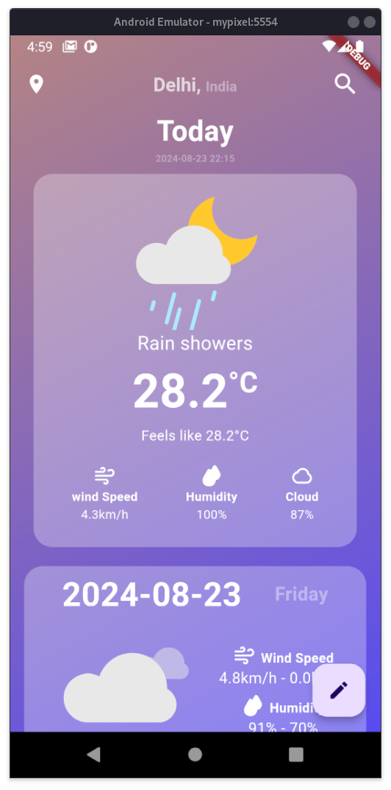
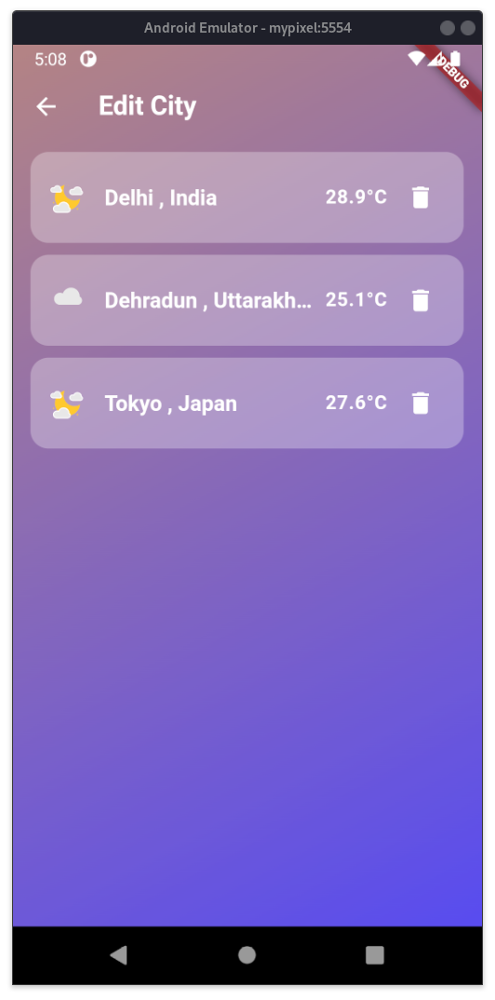
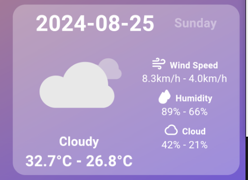
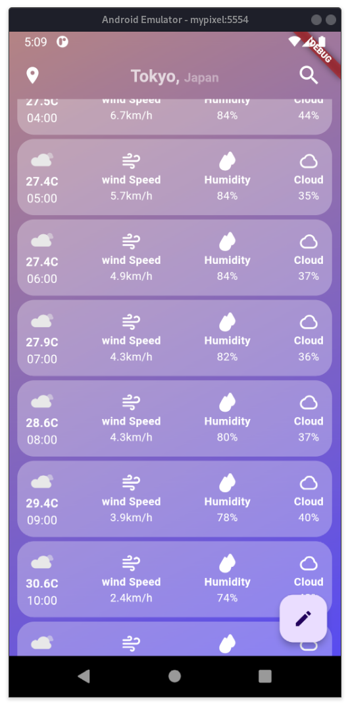
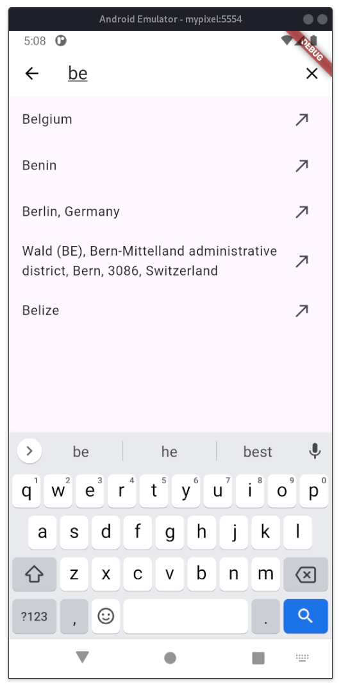

# Weather App

A modern, user-friendly weather application built with Flutter, utilizing the OpenMeteo API for accurate weather data and LocationIQ for seamless geocoding.

## Features

- **Real-Time Weather Updates:** Get up-to-the-minute weather information for any location.
- **Free and Open APIs:** Powered by OpenMeteo for weather data (no API key required) and LocationIQ for geocoding.
- **City Search:** Easily search and add cities to monitor weather conditions.
- **Weekly and Hourly Forecasts:** View detailed weather forecasts for the week ahead or by the hour.
- **Responsive Design:** Optimized for various screen sizes, ensuring a smooth experience on all devices.

## Built With

- **Flutter:** Cross-platform framework for building natively compiled applications.
- **OpenMeteo:** Free, reliable weather data without the need for an API key.
- **LocationIQ:** Geocoding service to convert location data into precise coordinates.

## Screenshots

- **Home Screen**  
  

- **City Edit Screen**  
  

- **Weekly Forecast Screen**  
  

- **Hourly Forecast Screen**  
  

- **Search Screen**  
  

## Getting Started

1. **Clone the repository:**
   ```bash
   git clone https://github.com/adityakumar-dev/weather_app
2. **Install packages:**
    ```bash 
    flutter pub get
3. **create .env**
    ```bash
    touch .env
4. **Create Account on Locationiq and get your free api key and paste it into a .env** 
    ```bash
    LOCATION_API="YOUR_LOCATIONIQ_API",
    WEATHER_BASE_URL="https://api.open-meteo.com/v1/forecast",
    WEATHER_URL_VALUES="&timezone=auto&current=temperature_2m,wind_speed_10m,cloud_cover,is_day,weather_code,relative_humidity_2m&hourly=temperature_2m,relative_humidity_2m,wind_speed_10m,cloud_cover,weather_code,is_day",
5. **Add Location Permissions Android**
    - paste this permission on AndroidManifest.xml

    ```bash
        <uses-permission android:name="android.permission.ACCESS_FINE_LOCATION" />
        <uses-permission android:name="android.permission.ACCESS_COARSE_LOCATION" />
        <uses-permission android:name="android.permission.ACCESS_BACKGROUND_LOCATION" />
        <uses-permission android:name="android.permission.INTERNET" />
